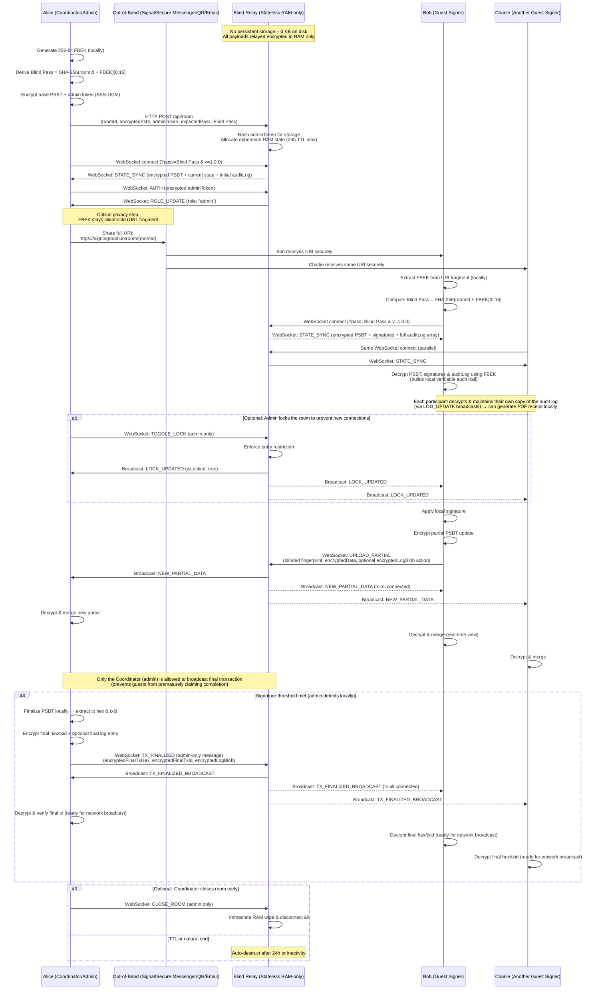

```text
BIP: ?
  Layer: Applications
  Title: Blind Relay: Stateless Encrypted WebSocket Coordination for PSBTs
  Author: Sean Carlin <seancarlin90@googlemail.com>
  Comments-URI: https://github.com/scarlin90/bip-stateless-psbt-coordination/issues
  Status: Draft
  Type: Standards Track
  Created: 2026-03-20
  License: CC0-1.0
  License-Code: BSD-3-Clause
  Requires: 174
  ```

## Abstract

This document proposes a standard for the trustless coordination of multi-signature Partially Signed Bitcoin Transactions (PSBTs) utilizing an ephemeral, stateless End-to-End Encrypted (E2EE) WebSocket relay. 

Currently, coordinating N-of-M Bitcoin transactions suffers from a Coordination Vulnerability. Users must either pass PSBTs manually out-of-band or rely on stateful, centralized servers that inherently leak metadata, signer identities, and quorum relationships. 

To resolve this, this standard introduces a Blind Relay architecture. By utilizing AES-GCM-256 encryption with decryption keys stored exclusively in client-side URL fragments or passed out of band, the protocol ensures that sensitive transaction data is never exposed to the server. The relay facilitates real-time, synchronous updates via WebSockets but maintains a strict zero-disk-state and zero-knowledge stance. It routes encrypted payloads strictly in RAM for a max 24 hours or until the signing event has completed. Upon destruction, it retains no transaction content or persistent metadata. This provides the real-time user experience of a centralized coordinator while preserving the security and privacy guarantees of an air-gapped workflow.

## Motivation

Bitcoin multi-signature (N-of-M) coordination currently suffers from a Coordination Gap. While the security of signing devices has evolved rapidly, the process of passing Partially Signed Bitcoin Transactions (PSBTs) between signers remains a critical friction point for all users.

Existing solutions force users into a binary choice, both of which are inadequate:
* Manual, Out-of-Band Transfers (USB drives, emails, secure messaging): Preserves privacy but introduces heavy operational friction, latency, and human error, making cross-device participation difficult.
* Stateful Coordination Servers: Centralized databases provide a seamless User Experience (UX) but act as privacy honeypots. They log sensitive metadata, IP addresses, quorum relationships, and often store PSBTs on disk. Furthermore, some platforms hold extended public keys (xpubs) to enforce vendor lock-in, or drift toward quasi-custodial models that inherently compromise the trustless security guarantees of the network.

The Bitcoin community has previously recognized the need for standardized, encrypted coordination. In 2023, BIP 77 (Async Payjoin) successfully introduced a directory-based standard for 2-party transactions, utilizing out-of-band URI sharing to establish encrypted routing. However, BIP 77 relies on an asynchronous store and forward architecture. The directory server must write encrypted payloads to disk until the receiver comes online. While sufficient for 1-to-1 Payjoin, storing multi-party payloads on disk introduces Directory Denial of Service (DoS) vectors and latency for iterative, real-time N-of-M signing rounds.

To bridge this gap, this protocol provides a Digital Airgap. By utilizing full-duplex WebSockets to stream PSBTs instantly between peers, it provides the real-time convenience of a centralized server without many of the associated privacy leaks.

The motivation for this protocol is to establish a standard that:
* Eliminates Metadata Persistence: Utilizing stateless workers ensures no transaction data or quorum associations are ever written to disk.
* Enforces Zero-Knowledge: The server cannot decrypt the data it relays. Decryption keys are shared strictly out-of-band or via URL fragments
* Streamlines UX: Provides a web-standard URI for instant, cross-device participation, allowing hardware wallets and software clients to coordinate seamlessly.

## Relation to Other BIPs

This proposal builds directly on [BIP 174](https://github.com/bitcoin/bips/blob/master/bip-0174.mediawiki) (Partially Signed Bitcoin Transactions). It serves as a real-time, multi-party complement to [BIP 77](https://github.com/bitcoin/bips/blob/master/bip-0077.md) (Async Payjoin). While BIP 77 provides an asynchronous store-and-forward directory suitable for 2-party coordination, this BIP targets interactive N-of-M multisig ceremonies with strict ephemerality, zero persistent storage on the relay, and blinded zero-knowledge routing.

## Rationale

### Why AES-GCM-256 over ChaCha20-Poly1305?
This proposal utilizes AES-GCM-256 for application-level payload encryption. While ChaCha20-Poly1305 is utilized in [BIP 324](https://github.com/bitcoin/bips/blob/master/bip-0324.mediawiki) for node-to-node transport obfuscation, the choice of AES-GCM is driven by the requirement for maximum ubiquity across user-facing platforms:
* AES-GCM is a core primitive of the Web Crypto API, which is implemented natively and audited by browser vendors. Utilizing this native support allows browser-based and mobile clients to use secure, OS-level cryptographic providers rather than relying on external, unoptimized JavaScript-based libraries.
* Because this protocol operates over HTTPS/WSS, the underlying TLS layer already provides the pseudorandom bytestream characteristics and transport-level obfuscation required for censorship resistance.

### Why WebSockets over HTTP Polling?
While BIP 77 utilizes HTTP polling for its asynchronous directory, polling introduces significant overhead and latency. In a complex N-of-M multi-signature ceremony where participants may be actively filtering dozens of inputs/outputs or passing a PSBT through 5-7 signing rounds, sub-second latency is required and ensures the coordination is efficient for all users. Full-duplex WebSockets allow the relay to push payloads instantly to all connected clients without the overhead of continuous HTTP GET requests.

### Why a Central Relay instead of WebRTC (P2P)?
An alternative design considered was utilizing WebRTC for true peer-to-peer (P2P) coordination. However, WebRTC inherently exposes the IP addresses of the participants to one another to establish the connection. In a multi-sig quorum where signers may not trust each other (e.g., two anonymous counterparties), IP leakage is a severe privacy flaw. A Blind Relay acts as a protective proxy, masking the peers' IP addresses from each other while remaining ignorant of the payload.

### Why URL Fragments for Key Distribution?
The protocol relies on URL fragments (#) for distributing the AES-GCM-256 decryption key. By internet standard (RFC 3986), URL fragments are evaluated strictly client-side by the browser or application and are not transmitted to the server during an HTTP or WebSocket handshake. This provides a mathematically guaranteed, frictionless mechanism to distribute the room location and the decryption key in a single string, without ever exposing the key to the relay. Furthermore, it preserves the flexibility to distribute the room URI and the decryption key via separate out-of-band channels if maximum operational security is required.

### Why Ephemeral RAM State over Disk Storage?
Unlike the persistent store-and-forward model of BIP 77, which writes encrypted payloads to a database, this protocol utilizes an ephemeral, RAM-only architecture. Participants are not strictly required to be online simultaneously. The relay holds the encrypted PSBT state in memory for a maximum of 24 hours. If a signer disconnects, they can seamlessly rejoin the room using the shared URI to establish a new WebSocket session and retrieve the current payload. Storing encrypted PSBTs on disk inherently introduces metadata storage risks. By enforcing a strict RAM-only policy where rooms self-destruct after 24 hours, upon explicit completion, or when the user closes the room, the relay removes many of the legal and security liabilities of persisting encrypted financial data.

### Why a dedicated WebSocket Blind Relay instead of Nostr?
Nostr is a robust, decentralized protocol well-suited for long-lived, discoverable events and has seen growing adoption in the Bitcoin ecosystem. However, its design prioritizes persistence and global replication so that users can fetch historical data from any relay.
For real-time multisig PSBT coordination, this proposal deliberately chooses a different set of trade-offs:

* **Ephemerality by default**: The Blind Relay is optimized for short-lived "forgetting" rather than long-term storage. Rooms exist only in volatile RAM with a hard maximum TTL of 24 hours (or explicit destruction upon completion). This minimizes the operational and legal surface of holding encrypted financial data, even temporarily. While specialized ephemeral Nostr relays exist, a purpose-built stateless WebSocket architecture makes strict RAM-only guarantees and automatic self-destruction simpler and more predictable for relay operators.
* **Metadata minimization**: This protocol uses blinded fingerprints derived from the per-room FBEK, so the relay learns neither payload contents nor participant identities. Nostr's event model, while flexible, often exposes more structural metadata (e.g., pubkey relationships) to relays unless additional layering is applied.
* **Performance for interactive ceremonies**: Complex N-of-M signing rounds—especially those involving dozens of inputs/outputs or 5–7 iterative passes—benefit from sub-second full-duplex updates and low-overhead binary-capable payloads. A dedicated WebSocket schema tailored to PSBT state synchronization provides this latency and efficiency with minimal ceremony, while remaining complementary to broader Nostr-based tools in the ecosystem.

In short, Nostr excels at persistent, permissionless communication; this BIP focuses on a narrow, high-privacy, real-time coordination primitive that can coexist with (and potentially integrate into) the wider Nostr world if desired.

### Addressing Client Environment Concerns
A common objection to web-based PSBT coordination is the risk of malicious browser extensions or compromised web environments. It is important to note that this BIP standardizes the transport protocol, not the client environment. While reference implementations may use Progressive Web Apps (PWAs), this WebSocket standard is designed to be natively integrated directly into desktop hardware wallet companions or mobile applications, entirely bypassing the browser environment if desired for maximum opsec.

## Specification

### Encryption Standard
All payloads and metadata MUST be encrypted client-side utilizing AES-GCM-256. Decryption keys MUST be generated using a Cryptographically Secure Pseudorandom Number Generator (CSPRNG).

### URI Scheme
The coordination URI is the primary mechanism for sharing access to a session. It MUST follow a specific structure to allow clients to automatically extract connection parameters and the decryption key.

#### Anatomy of the URI
This section is non-normative and provides a simplified overview of the coordination URI syntax. Please see the sections below for the normative requirements regarding fragment isolation and cryptographic blinding.

##### URI format
`<base_url>/room/<room_id>#<fbek>`

* `[]` means optional, `< >` are placeholders
* `<base_url>`: The HTTPS endpoint of the relay (e.g. `https://signingroom.io`)
* `<room_id>`: A unique UUID (Version 4) identifying the specific session.
* `<fbek>`: The 256-bit AES-GCM key, encoded as a URL-safe Base64 string.

**Examples**
A standard coordination link:
`https://signingroom.io/room/123e4567-e89b-12d3-a456-426614174000#AQEBAQEBAQEBAQEBAQEBAQEBAQEBAQEBAQEBAQEBAQE=`

A link utilizing a self-hosted or local relay:
`https://relay.my-node.local/room/550e8400-e29b-41d4-a716-446655440000#YmFzZTY0LWVuY29kZWQtMTI4LWJpdC1rZXk=`

**Note**: This HTTPS URI is the shared entry point. Clients MUST derive the WebSocket upgrade URI from the `<base_url>` (typically `wss://<base_url>/api/room/<room_id>/websocket`). The fragment (#<fbek>) MUST never be transmitted to the relay (per RFC 3986).

#### Client Handling Requirements
To prevent accidental key exposure to the relay infrastructure, compliant clients MUST adhere to the following:
* Fragment Isolation: The client MUST extract the FBEK locally from the window location fragment.
* Non-Transmission: The FBEK MUST NOT be included in any HTTP headers, POST bodies, or WebSocket query parameters sent to the relay.
* Persistence: If the client is a web browser, the FBEK SHOULD be stored only in volatile memory and never in persistent localStorage.

### Cryptographic Blinding (Zero-Knowledge Routing)
To ensure the relay cannot harvest metadata from WebSocket routes or payload envelopes, clients MUST deterministically "blind" identifiable metadata using the FBEK as a salt. 

The standard derivation function for blinded metadata is:
`Blind(data) = SHA-256(data + FBEK)[0:16]` *(Truncated to the first 16 hexadecimal characters)*.
**NOTE**: The truncation to the first 16 hexadecimal characters (8 bytes) is sufficient in this context because rooms are ephemeral and the number of signers per room is expected to be small.

#### Room Authentication (The Blind Pass)
To prevent unauthorized socket connections, the relay MUST require a pass parameter during the WebSocket upgrade. 
* **Derivation:** `Blind(roomId)`
* **Transmission:** Sent as a query parameter in the WebSocket URI.
* **Example:** `wss://relay.example.com/api/room/<roomId>/websocket?v=1.0.0&pass=7dc1021170184a58`

#### Signer Fingerprint Blinding
Clients MUST NOT transmit raw BIP-32 hardware wallet fingerprints in plain text. Whenever a fingerprint is required for routing (e.g., uploading a signature), the client MUST blind it.
* **Derivation:** `Blind(fingerprint)`
* **Result:** The relay can route signature updates associated with a specific signer without ever knowing the signer's true master fingerprint.

### Message Schema
All communication over the WebSocket MUST use a JSON-based message format. Every message MUST contain a type field. All sensitive payload data, including logs and room names, MUST be transmitted as opaque Base64-encoded strings encrypted via AES-GCM.

#### Client-to-Relay Messages

**AUTH**: Sent by the Coordinator to claim administrative privileges. The token is an encrypted UUID.
```json
{ 
  "type": "AUTH", 
  "token": "base64_encrypted_admin_token" 
}
```

**UPLOAD_PARTIAL**: Sent by any participant to contribute a signed PSBT fragment. Includes a client-generated encrypted log event.
```json
{ 
  "type": "UPLOAD_PARTIAL", 
  "fingerprint": "16_char_blinded_hex_string", 
  "data": { "encryptedData": "base64_encrypted_psbt_blob" },
  "encryptedLogBlob": "base64_encrypted_log_json"
}
```

**UPDATE_LABEL**: (Admin Only) Maps a blinded signer fingerprint to an encrypted alias.
```json
{ 
  "type": "UPDATE_LABEL", 
  "fingerprint": "16_char_blinded_hex_string", 
  "label": "base64_encrypted_label",
  "encryptedLogBlob": "base64_encrypted_log_json"
}
```

**SET_DISPLAY_NAME**: Any participant MAY self-identify with a display name. This MUST be encrypted with the FBEK to remain invisible to the relay.
```json
{ 
  "type": "SET_DISPLAY_NAME", 
  "encryptedDisplayName": "base64_blob" 
}
```

**RENAME_ROOM**: (Admin Only) Updates the metadata title of the session.
```json
{ 
  "type": "RENAME_ROOM", 
  "encryptedName": "base64_encrypted_room_name",
  "encryptedLogBlob": "base64_encrypted_log_json"
}
```

**TOGGLE_LOCK**: (Admin Only) Prevents new guests from joining the WebSocket session.
```json
{ 
  "type": "TOGGLE_LOCK", 
  "isLocked": true,
  "encryptedLogBlob": "base64_encrypted_log_json"
}
```

**UPDATE_WHITELIST**: (Admin Only) Replaces the entire verified address list. Used for both single and batch approvals.
```json
{ 
  "type": "UPDATE_WHITELIST", 
  "encryptedWhitelist": "base64_encrypted_array",
  "encryptedLogBlob": "base64_encrypted_log_json"
}
```

**LOG_ACTION**: Sent by clients to append a standalone event to the audit log (e.g., user joined, PSBT downloaded).
```json
{ 
  "type": "LOG_ACTION", 
  "encryptedLogBlob": "base64_encrypted_log_json"
}
```

**TX_FINALIZED**: (Admin Only) Transmits the resulting transaction hash and hex upon successful signature threshold.
```json
{ 
  "type": "TX_FINALIZED", 
  "encryptedFinalTxHex": "base64_encrypted_hex",
  "encryptedFinalTxId": "base64_encrypted_txid",
  "encryptedLogBlob": "base64_encrypted_log_json"
}
```

#### Relay-to-Client Messages

**SESSION_CONNECTED**: Sent by the relay immediately after the WebSocket handshake is accepted to provide the client with a temporary, room-specific identifier.
```json
{ 
  "type": "SESSION_CONNECTED", 
  "sessionId": "4_char_alphanumeric_string" 
}
```

**STATE_SYNC**: The initial payload sent to every connecting client. **MUST NOT** include the `adminToken`. All metadata is strictly encrypted.
```json
{ 
    "type": "STATE_SYNC", 
    "roomId": "uuid_string", 
    "network": "bitcoin|testnet|signet", 
    "roomName": "base64_encrypted_room_name", 
    "encryptedPsbt": "base64_encrypted_psbt", 
    "signatures": ["base64_encrypted_psbt"], 
    "isLocked": "boolean", 
    "auditLog": ["base64_encrypted_log_json"], 
    "signerLabels": {"blinded_hex_fingerprint": "base64_encrypted_label"}, 
    "whitelist": "base64_encrypted_array", 
    "encryptedFinalTxHex": "base64_encrypted_hex",
    "encryptedFinalTxId": "base64_encrypted_txid",
    "connectedCount": "number", 
    "protocolVersion": "semver_string" 
}
```

**ROLE_UPDATE**: Confirms a successful `AUTH` challenge.
```json
{ "type": "ROLE_UPDATE", "role": "admin" }
```

**CONNECTIONS_UPDATE**: Broadcast whenever a participant joins, leaves, or updates their display name.
```json
{ 
  "type": "CONNECTIONS_UPDATE", 
  "count": 2,
  "sessions": [
    { "id": "A1B2", "role": "admin", "encryptedDisplayName": "base64_blob" }
  ]
}
```

**NEW_PARTIAL_DATA**: Broadcast to all participants when a signature is contributed.
```json
{ "type": "NEW_PARTIAL_DATA", "data": { "encryptedData": "base64_blob" }, "fingerprint": "hex_string" }
```

**ROOM_RENAMED**: Broadcast when the Coordinator updates the session title.
```json
{ "type": "ROOM_RENAMED", "encryptedName": "base64_encrypted_room_name" }
```

**LABELS_UPDATED**: Broadcast when signer aliases are added or modified.
```json
{ "type": "LABELS_UPDATED", "signerLabels": { "fingerprint": "base64_encrypted_label" } }
```

**WHITELIST_UPDATED**: Broadcast when the address verification list is modified.
```json
{ "type": "WHITELIST_UPDATED", "encryptedWhitelist": "base64_encrypted_array" }
```

**LOG_UPDATE**: Broadcast to keep participants' audit logs in sync. The payload is an array of opaque strings.
```json
{ "type": "LOG_UPDATE", "auditLog": ["base64_encrypted_log_json", "base64_encrypted_log_json"] }
```

**LOCK_UPDATED**: Broadcast to notify guests of room entry restrictions.
```json
{ "type": "LOCK_UPDATED", "isLocked": true }
```

**TX_FINALIZED_BROADCAST**: Broadcast to all participants when the transaction is ready for network submission.
```json
{ 
  "type": "TX_FINALIZED_BROADCAST", 
  "encryptedFinalTxHex": "base64_encrypted_hex",
  "encryptedFinalTxId": "base64_encrypted_txid"
}
```

**ERROR_VERSION_MISMATCH**: Sent before closing the socket if the Major version is incompatible.
```json
{ "type": "ERROR_VERSION_MISMATCH", "roomVersion": "semver_string" }
```

**ERROR / ERROR_LOCKED / ERROR_NOT_FOUND**: Relays MUST use standardized error handling to disconnect unauthorized clients.
```json
{ 
    "type": "ERROR", 
    "message": "Payload too large (Max 2MB)" 
}
```

### Coordinator Flow
The Coordinator (Admin) is the initiator of the coordination session. They are responsible for defining the transaction parameters and managing the room's lifecycle.



#### Room Initialization
To begin a session, the Coordinator MUST generate a local 256-bit AES-GCM key (FBEK). They then transmit a `POST` request to the relay's `/api/room` endpoint. Upon a successful initialization, the relay MUST return an HTTP 200 OK response with a JSON body containing the `roomId` and the relative `socketUrl` for the WebSocket upgrade.
The request body MUST contain:
* **roomId**: A unique UUID
* **expectedPass**: The blinded Room Pass (Blind(roomId)).
* **encryptedPsbt**: The base PSBT, encrypted with the FBEK.
* **adminToken**: An encrypted UUID used to prove ownership.
* **network**: The Bitcoin network context (mainnet, testnet, signet).
* **protocolVersion**: The Semantic Version of the client.
* **encryptedRoomName**: A default session title (e.g., "Untitled Room"), encrypted with the FBEK. Because AES-GCM enforces unique Initialization Vectors, the server cannot perform frequency analysis on this ciphertext.
* **encryptedLogBlob**: The initial "Room Created" audit log.

To ensure zero-knowledge, the relay MUST hash the `adminToken` using SHA-256 before storing it in state, ensuring the raw authentication string is never persisted.

#### HTTP Status Codes 
During the initial `POST /api/room` or the WebSocket upgrade request, the relay SHOULD return standard HTTP status codes:
| Code | Label | Phase | Reason |
| :--- | :--- | :--- | :--- |
| **101** | Switching Protocols | Upgrade | Successful transition from HTTP to WebSocket. |
| **200** | OK | POST | Room successfully initialized in RAM. |
| **401** | Unauthorized | Upgrade | The `pass` parameter does not match the `expectedPass`. |
| **413** | Payload Too Large | POST | The base PSBT exceeds the relay's maximum buffer (e.g., 2MB). |
| **426** | Upgrade Required | Upgrade | The request did not include proper WebSocket upgrade headers. |
| **429** | Too Many Requests | Both | The client's IP has exceeded rate or connection limits. |

#### WebSocket Upgrade and Authentication
Once the Coordinator receives the HTTP 200 response, they establish a WebSocket connection. The relay MUST return an HTTP 101 Switching Protocols status to confirm the upgrade. Immediately after the connection is accepted and STATE_SYNC is received, the Coordinator MUST send an AUTH message. The relay hashes the incoming token and compares it to the stored hash. If successful, the relay promotes the session to role: `admin` and broadcasts a `ROLE_UPDATE`.

#### WebSocket Status Codes
To ensure cross-client compatibility, compliant relays MUST utilize the following WebSocket status codes when terminating a connection. Codes in the 4xxx range are utilized for protocol-specific errors. Relays SHOULD attempt to send a JSON error message before closing the socket to provide more context to the client UI.

| Code | Label | Reason | Client Action |
| :--- | :--- | :--- | :--- |
| **1000** | Normal Closure or Locked | The room was closed or locked by the Coordinator or has naturally expired. | Stop. Notify user. |
| **4001** | Room Full | The session has reached the maximum allowed concurrent connections (Default: 40). | Wait and retry. |
| **4004** | Room Not Found | The roomId provided does not exist in the relay's volatile memory. | Stop. Verify URI. |
| **4026** | Protocol Mismatch | The client's Major version is incompatible with the relay or the room's protocol version. | Stop. Update client app. |

### Guest Flow
A Guest is any participant who joins a room via a shared URI to contribute a signature or monitor the coordination progress.

#### Connection and Handshake

The Guest client MUST extract the Fragment-Based Encryption Key (FBEK) from the URL fragment (the portion of the URI following the `#` character). The client MUST NOT transmit this fragment to the relay in the HTTP request or WebSocket handshake.

The Guest establishes a WebSocket connection to the relay's WebSocket endpoint. The client SHOULD include its protocol version in the connection string and the Blind Pass from the room authentication specification.

#### Session Identification
To facilitate UI coordination showing e.g. "Guest ABCD Joined", the relay assigns each connection a temporary sessionId. This ID allows participants to distinguish between different connections/sessions in the room and audit log without the relay or other peers learning the user's IP address or permanent identity. Upon a successful WebSocket upgrade, the relay MUST assign a transient, unique Session ID to the connection.
* The sessionId MUST be generated by the relay using a random alphanumeric string (RECOMMENDED: 4 uppercase characters).
* This identifier is ephemeral and tied strictly to the current WebSocket session. It MUST NOT be derived from the user's IP address, public keys, or any other persistent identifier.
* Upon a successful upgrade, the relay transmits the `SESSION_CONNECTED` message before sending the `STATE_SYNC`.


#### State Synchronization and Decryption

Upon a successful connection, the relay transmits a `STATE_SYNC` message containing the room's current encrypted state. The Guest client MUST:
* Receive the `encryptedPsbt` (Base64) and the `signatures` array.
* Use the FBEK to decrypt the `encryptedPsbt` to obtain the master PSBT.
* Iteratively decrypt each blob in the `signatures` array.
* Merge all valid decrypted signatures into the master PSBT locally to provide a real-time view of the transaction's progress.

#### Signature Contribution
To contribute a signature to the room, the Guest client MUST perform the following steps locally:
* **Validation**: Parse the local signed PSBT and extract the cryptographic fingerprint of the signer.
* **Deduplication**: Verify the extracted fingerprint against the existing signature list in the decrypted room state. If a signature for this fingerprint already exists, the client MUST NOT proceed with the upload.
* **Encryption**: Encrypt the partial PSBT data using the FBEK and a unique Initialization Vector (IV/Nonce).
* **Transmission**: Send the `UPLOAD_PARTIAL` message to the relay, ensuring the fingerprint is properly blinded:

```json
{ 
  "type": "UPLOAD_PARTIAL", 
  "fingerprint": "[16_char_blinded_hex_string]", 
  "data": { "encryptedData": "[base64-iv-plus-ciphertext-blob]" } 
}
```

#### State Propagation
When another participant contributes a signature, the relay broadcasts a `NEW_PARTIAL_DATA` event. The Guest client MUST decrypt this new blob and merge it into its local PSBT. If the local client determines that the required signature threshold has been met, it SHOULD signal to the user that the transaction is ready for finalization.

### Backwards Compatibility
This section outlines how the protocol handles version disparities between clients and relays to ensure a stable and predictable user experience.

#### Semantic Versioning (SemVer)
The protocol strictly follows Semantic Versioning (Major.Minor.Patch).
* **Major Version**: Indicates breaking changes in the message schema or encryption standard.
* **Minor Version**: Indicates new features (e.g., adding WHITELIST_BATCH_UPDATE) that are backwards compatible
* **Patch Version**: Indicates bug fixes or internal optimizations that do not affect the communication interface.

#### Version Enforcement
Compatibility is checked at the moment of the WebSocket handshake via the `v` query parameter.

* **Incompatible Major Version**: If a client with a newer major version attempts to connect to an older relay, the relay MUST reject the connection with an `ERROR_VERSION_MISMATCH` message and then terminate the socket.
* **Minor/Patch Version Mismatch**: Relays SHOULD allow connections with minor or patch mismatches, provided the message schema in use remains a subset of the higher version.

#### Client-Side Graceful Downgrade
If a client detects it is connecting to an older relay version, it MUST disable features not supported by that relay version to prevent protocol errors.

## Test Vectors
The following test vectors allow developers to verify their implementation of the AES-GCM-256 encryption, message enveloping, and cryptographic blinding layers.

### Cryptographic Primitives & Keys
To ensure determinism across these test vectors, the Initialization Vectors (IVs) are forced to sequential values rather than utilizing a CSPRNG. The global key utilized for all vectors below is a 32-byte array filled with `0x01`.
* **Raw Key (Hex)**: 0101010101010101010101010101010101010101010101010101010101010101
* **Global FBEK (Base64)**: AQEBAQEBAQEBAQEBAQEBAQEBAQEBAQEBAQEBAQEBAQE=

(Note: In a production environment, IVs and FBEKs MUST be generated using a CSPRNG).

#### Message Payload Vectors
All ciphertexts below are encoded in Base64 as the exact concatenation of IV + Ciphertext + AuthTag.

##### AUTH
* **adminSecret Plaintext (UUID)**: 4155db36-6997-4f67-8ccb-1d740c0f54b6
* **encryptedAdminToken IV (Hex)**: c8c9cacbcccdcecfd0d1d2d3
* **encryptedAdminToken Output (Base64)**: yMnKy8zNzs/Q0dLTvAb2ly5VhMUq82TLt9c3XgY+qehwI5XpC2XTbl5MTQWF9bWecZ5XUEkCH529CZN7aiVpBg==
* **Final Transmitted Token (SHA-256 of Base64)**: 385964357f9cf10af95036aeb45285463d627b404602d7b7f2f2e9b88a4bec8d
```json
{
  "type": "AUTH",
  "token": "385964357f9cf10af95036aeb45285463d627b404602d7b7f2f2e9b88a4bec8d"
}
```

##### UPLOAD_PARTIAL
* **Fingerprint Plaintext**: af4b013d
* **Fingerprint Output (Blinded)**: 07877d968ee881d3
* **encryptedData Plaintext**: "cHNidP8BAFICAAAA..."
* **encryptedData IV (Hex)**: 000102030405060708090a0b
* **encryptedData Output (Base64)**: AAECAwQFBgcICQoL2O7bT0SuPju/LK6HYSiJ4oDoRXCFKWQvVzkwe4ujHioDt10=
* **encryptedLogBlob Plaintext**: {"timestamp":1710000000000,"event":"Signature Uploaded","detail":"Signer: af4b013d","user":"Guest (ABCD)"}
* **encryptedLogBlob IV (Hex)**: 0c0d0e0f1011121314151617
* **encryptedData IV (Hex)**: 000102030405060708090a0b
* **encryptedLogBlob Output (Base64)**: DA0ODxAREhMUFRYX612JiwPP7EmQvnGcmvOxURTWp8kNSC8Ejv8bl6Vi5xwkAwgGrmxSEP9xiInxX4iPjMyQTzxiqWtGBXWw6NJ92u+Z4hVwHA/NXBmh13yXAraMzqeMGb9pNNCpTwkhKbZl2RAq3Rbh7V4M6QRwfL4cQdO53zYKrPPZYEI=
```json
{
  "type": "UPLOAD_PARTIAL",
  "fingerprint": "07877d968ee881d3",
  "data": {
    "encryptedData": "AAECAwQFBgcICQoL2O7bT0SuPju/LK6HYSiJ4oDoRXCFKWQvVzkwe4ujHioDt10="
  },
  "encryptedLogBlob": "DA0ODxAREhMUFRYX612JiwPP7EmQvnGcmvOxURTWp8kNSC8Ejv8bl6Vi5xwkAwgGrmxSEP9xiInxX4iPjMyQTzxiqWtGBXWw6NJ92u+Z4hVwHA/NXBmh13yXAraMzqeMGb9pNNCpTwkhKbZl2RAq3Rbh7V4M6QRwfL4cQdO53zYKrPPZYEI="
}
```

##### UPDATE_LABEL
* **label Plaintext**: "Bob - CFO"
* **label IV (Hex)**: 18191a1b1c1d1e1f20212223
* **label Output (Base64)**: GBkaGxwdHh8gISIjkojJaZC67eSRQZkvuALVzm565NRSdgpjQQ==
* **encryptedLogBlob Plaintext**: {"timestamp":1710000000000,"event":"Label Updated","detail":"Bob - CFO (af4b013d)","user":"Coordinator"}
* **encryptedLogBlob IV (Hex)**: 2425262728292a2b2c2d2e2f
* **encryptedLogBlob Output (Base64)**: JCUmJygpKissLS4v7XUur/MwOGniBCmKR6rWBeQr5208tNG/K07PN+h3yxZ9SJSgX+3HU3ps3D5Hno7A2kY6Qvt0FILOhmI2z3A7KldMjNM/hjBqUH+LqfLg6FQW6oc03H4NRd37UEpiYgfOiv9mbI0C4UpwZBpdopLHCPoe9RO4gAEY
```json
{
  "type": "UPDATE_LABEL",
  "fingerprint": "07877d968ee881d3",
  "label": "GBkaGxwdHh8gISIjkojJaZC67eSRQZkvuALVzm565NRSdgpjQQ==",
  "encryptedLogBlob": "JCUmJygpKissLS4v7XUur/MwOGniBCmKR6rWBeQr5208tNG/K07PN+h3yxZ9SJSgX+3HU3ps3D5Hno7A2kY6Qvt0FILOhmI2z3A7KldMjNM/hjBqUH+LqfLg6FQW6oc03H4NRd37UEpiYgfOiv9mbI0C4UpwZBpdopLHCPoe9RO4gAEY"
}
```

##### SET_DISPLAY_NAME
* **encryptedDisplayName Plaintext**: "Alice (Ledger)"
* **encryptedDisplayName IV (Hex)**: 303132333435363738393a3b
* **encryptedDisplayName Output (Base64)**: MDEyMzQ1Njc4OTo7WVOKPIr7HvDsNFdO0LXrLlLr32OLRZHne84CHoLv
```json
{
  "type": "SET_DISPLAY_NAME",
  "encryptedDisplayName": "MDEyMzQ1Njc4OTo7WVOKPIr7HvDsNFdO0LXrLlLr32OLRZHne84CHoLv"
}
```

##### RENAME_ROOM
* **encryptedName Plaintext**: "Q1 Treasury Board Vote"
* **encryptedName IV (Hex)**: 3c3d3e3f4041424344454647
* **encryptedName Output (Base64)**: PD0+P0BBQkNERUZHApT2Gnt86Im5Dp5eT8Hwclxpiwq4EpmB5Qq54wkY5ZNKYc3iej0=
* **encryptedLogBlob Plaintext**: {"timestamp":1710000000000,"event":"Room Renamed","detail":"Renamed: Q1 Treasury Board Vote","user":"Coordinator"}
* **encryptedLogBlob IV (Hex)**: 48494a4b4c4d4e4f50515253
* **encryptedLogBlob Output (Base64)**: SElKS0xNTk9QUVJTrSCuBxkVtcqHoR3s72m42zCPOAcS2pwIkZZyFgs20HlSrXRg+SHG/7DwMhh15Gsc1DhiolBt3NDqoyU+kRPb1aaaxcYjd1fWrr+l23on+1WIPoPvunDG9KHbMGAbb8o4pCMTIQtsG10UoItpvOyhuu3fnBAaJbsFDk5d+TGBb7Kouw==
```json
{
  "type": "RENAME_ROOM",
  "encryptedName": "PD0+P0BBQkNERUZHApT2Gnt86Im5Dp5eT8Hwclxpiwq4EpmB5Qq54wkY5ZNKYc3iej0=",
  "encryptedLogBlob": "SElKS0xNTk9QUVJTrSCuBxkVtcqHoR3s72m42zCPOAcS2pwIkZZyFgs20HlSrXRg+SHG/7DwMhh15Gsc1DhiolBt3NDqoyU+kRPb1aaaxcYjd1fWrr+l23on+1WIPoPvunDG9KHbMGAbb8o4pCMTIQtsG10UoItpvOyhuu3fnBAaJbsFDk5d+TGBb7Kouw=="
}
```

##### TOGGLE_LOCK
* **isLocked Plaintext (Boolean)**: true
* **encryptedLogBlob Plaintext**: {"timestamp":1710000000000,"event":"Room Locked","detail":"Coordinator locked the room","user":"Coordinator"}
* **encryptedLogBlob IV (Hex)**: 5455565758595a5b5c5d5e5f
* **encryptedLogBlob Output (Base64)**: VFVWV1hZWltcXV5fqyBB6fx3SkS1KFn7KtW8IP6y1lecR7WvTJk9nk9D0HX8W2KBmH44OoQoM3DvBuqD1OputdXcwUqXyRuTMZnbBc79u33KUZCqb30q77xSicuET+SqIbScP4yjYx93etkt9KWiX/mqQA+8F0xxE/cyu316ILC90hokMi9hzPo=
```json
{
  "type": "TOGGLE_LOCK",
  "isLocked": true,
  "encryptedLogBlob": "VFVWV1hZWltcXV5fqyBB6fx3SkS1KFn7KtW8IP6y1lecR7WvTJk9nk9D0HX8W2KBmH44OoQoM3DvBuqD1OputdXcwUqXyRuTMZnbBc79u33KUZCqb30q77xSicuET+SqIbScP4yjYx93etkt9KWiX/mqQA+8F0xxE/cyu316ILC90hokMi9hzPo="
}
```

##### UPDATE_WHITELIST
* **encryptedWhitelist Plaintext**: ["bc1q04e2117f1b09f7c6a6ff92daecfb9a4de57bc4ca18e33933f28d1067d81b3196"]
* **encryptedWhitelist IV (Hex)**: 606162636465666768696a6b
* **encryptedWhitelist Output (Base64)**: YGFiY2RlZmdoaWprjYaFId7HyuhIllE5ZO9sZIbQaFFNRf6J8fsoXJWRHB2RMb+FCDLuHfplebtxlR1ha6PfiQG7ct0lY5j9gDnBduTZIdKKduUE2i0D49jRXFoceme9jEc5lg==
* **encryptedLogBlob Plaintext**: {"timestamp":1710000000000,"event":"Whitelist Updated","detail":"Added ...b3196 to whitelist","user":"Coordinator"}
* **encryptedLogBlob IV (Hex)**: 6c6d6e6f7071727374757677
* **encryptedLogBlob Output (Base64)**: bG1ub3BxcnN0dXZ3V4FtGiCXVi+oXG3ZU3D5qKDCHfMaxoLIgSuQeCXe/hSpqQEqLeySa8va2QgGF0FqY0mEwOO7DJYhXHEeciok0zUKPf3UbQ7xDttzB17ISbkSJ/Ym/rKKerLK3u9tHixKT3PMhA84IrJjgl/cVal/rrAR849AC1kNKfO2dBKKRUHD5KQ=
```json
{
  "type": "UPDATE_WHITELIST",
  "encryptedWhitelist": "YGFiY2RlZmdoaWprjYaFId7HyuhIllE5ZO9sZIbQaFFNRf6J8fsoXJWRHB2RMb+FCDLuHfplebtxlR1ha6PfiQG7ct0lY5j9gDnBduTZIdKKduUE2i0D49jRXFoceme9jEc5lg==",
  "encryptedLogBlob": "bG1ub3BxcnN0dXZ3V4FtGiCXVi+oXG3ZU3D5qKDCHfMaxoLIgSuQeCXe/hSpqQEqLeySa8va2QgGF0FqY0mEwOO7DJYhXHEeciok0zUKPf3UbQ7xDttzB17ISbkSJ/Ym/rKKerLK3u9tHixKT3PMhA84IrJjgl/cVal/rrAR849AC1kNKfO2dBKKRUHD5KQ="
}
```

##### LOG_ACTION
* **encryptedLogBlob Plaintext**: {"timestamp":1710000000000,"event":"PSBT Downloaded","detail":"Unsigned file exported","user":"Guest (ABCD)"}
* **encryptedLogBlob IV (Hex)**: 78797a7b7c7d7e7f80818283
* **encryptedLogBlob Output (Base64)**: eHl6e3x9fn+AgYKDkZ6EVhDiYoPOinszPtfPnwQ2lGb5MX62zEXx6uofLemeUURFx0BqVqPEhv7obgnAQ3fNxVxt1kp8LgPGTXjEdDxasF6B6mjF9fM+wVnoWS0bd1RIIVgVk+tsnFDK67bjoxlepbiKEKx4qcKJLPL4ZnaUZrIAD3bq7CuDe5s=
```json
{
  "type": "LOG_ACTION",
  "encryptedLogBlob": "eHl6e3x9fn+AgYKDkZ6EVhDiYoPOinszPtfPnwQ2lGb5MX62zEXx6uofLemeUURFx0BqVqPEhv7obgnAQ3fNxVxt1kp8LgPGTXjEdDxasF6B6mjF9fM+wVnoWS0bd1RIIVgVk+tsnFDK67bjoxlepbiKEKx4qcKJLPL4ZnaUZrIAD3bq7CuDe5s="
}
```

##### TX_FINALIZED
* **encryptedFinalTxHex Plaintext**: "0200000000010153ae6e073b..."
* **encryptedFinalTxHex IV (Hex)**: 8485868788898a8b8c8d8e8f
* **encryptedFinalTxHex Output (Base64)**: hIWGh4iJiouMjY6Po6bGWQcaR/ydWIq+MUMWlJ9eTJREBntkwsnqWXey3kNvNBd+69akuHxAmA==
* **encryptedFinalTxId Plaintext**: "6698923ed3153ddb30b96bff7924f47f67e184d243e5bc57098166967c193ce3"
* **encryptedFinalTxId IV (Hex)**: 909192939495969798999a9b
* **encryptedFinalTxId Output (Base64)**: kJGSk5SVlpeYmZqbk+ovJ16rTnsYtqlmFlU2aZOtpvQ7Uf71N10QjsDofckiVpYDHQTxgngtfEPR9UYiWvEHNX7ZcIX4BtB6mhkFv9449uilLKrhojRGxMGj3mk=
* **encryptedLogBlob Plaintext**: {"timestamp":1710000000000,"event":"Tx Finalized","detail":"Signatures merged successfully","user":"Coordinator"}
* **encryptedLogBlob IV (Hex)**: 9c9d9e9fa0a1a2a3a4a5a6a7
* **encryptedLogBlob Output (Base64)**: nJ2en6ChoqOkpaanfLL7ZjeGq7WbhsM5KCHWYcmDjUY2Hp1WDPbZ9E/vm132F7wDO3Srqq8C6Lrq9ZmDdHDJjtqOt/sWN6Gw6HXr8SogTRxBVUeEyKfa0SRq9TbcV1F5x741I3D/SjBDRxLr4DICH8eEYm3Nw+Mh4OiBAgYYiv5kvFtKxcevT6klvi0z
```json
{
  "type": "TX_FINALIZED",
  "encryptedFinalTxHex": "hIWGh4iJiouMjY6Po6bGWQcaR/ydWIq+MUMWlJ9eTJREBntkwsnqWXey3kNvNBd+69akuHxAmA==",
  "encryptedFinalTxId": "kJGSk5SVlpeYmZqbk+ovJ16rTnsYtqlmFlU2aZOtpvQ7Uf71N10QjsDofckiVpYDHQTxgngtfEPR9UYiWvEHNX7ZcIX4BtB6mhkFv9449uilLKrhojRGxMGj3mk=",
  "encryptedLogBlob": "nJ2en6ChoqOkpaanfLL7ZjeGq7WbhsM5KCHWYcmDjUY2Hp1WDPbZ9E/vm132F7wDO3Srqq8C6Lrq9ZmDdHDJjtqOt/sWN6Gw6HXr8SogTRxBVUeEyKfa0SRq9TbcV1F5x741I3D/SjBDRxLr4DICH8eEYm3Nw+Mh4OiBAgYYiv5kvFtKxcevT6klvi0z"
}
```

### Message Payload Vectors (Relay-to-Client)

The Relay acts strictly as an aggregator and router. It does not encrypt data. The STATE_SYNC and CONNECTIONS_UPDATE vectors below demonstrate how the server stores and broadcasts the exact opaque ciphertexts uploaded by the clients in the vectors above.

##### CONNECTIONS_UPDATE
Demonstrates how the relay broadcasts the encryptedDisplayName without being able to read its contents.

```json
{
  "type": "CONNECTIONS_UPDATE",
  "count": 2,
  "sessions": [
    {
      "id": "a1b2c3d4",
      "role": "admin",
      "encryptedDisplayName": "MDEyMzQ1Njc4OTo7WVOKPIr7HvDsNFdO0LXrLlLr32OLRZHne84CHoLv"
    },
    {
      "id": "e5f6g7h8",
      "role": "guest"
    }
  ]
}
```

#### STATE_SYNC (Server-to-Client Aggregation)
```json 
{
  "type": "STATE_SYNC",
  "roomId": "123e4567-e89b-12d3-a456-426614174000",
  "network": "bitcoin",
  "roomName": "PD0+P0BBQkNERUZHApT2Gnt86Im5Dp5eT8Hwclxpiwq4EpmB5Qq54wkY5ZNKYc3iej0=",
  "encryptedPsbt": "AAECAwQFBgcICQoL2O7bT0SuPju/LK6HYSiJ4oDoRXCFKWQvVzkwe4ujHioDt10=",
  "signatures": [
    "AAECAwQFBgcICQoL2O7bT0SuPju/LK6HYSiJ4oDoRXCFKWQvVzkwe4ujHioDt10="
  ],
  "isLocked": true,
  "auditLog": [
    "DA0ODxAREhMUFRYX612JiwPP7EmQvnGcmvOxURTWp8kNSC8Ejv8bl6Vi5xwkAwgGrmxSEP9xiInxX4iPjMyQTzxiqWtGBXWw6NJ92u+Z4hVwHA/NXBmh13yXAraMzqeMGb9pNNCpTwkhKbZl2RAq3Rbh7V4M6QRwfL4cQdO53zYKrPPZYEI="
  ],
  "signerLabels": {
    "07877d968ee881d3": "GBkaGxwdHh8gISIjkojJaZC67eSRQZkvuALVzm565NRSdgpjQQ=="
  },
  "whitelist": "YGFiY2RlZmdoaWprjYaFId7HyuhIllE5ZO9sZIbQaFFNRf6J8fsoXJWRHB2RMb+FCDLuHfplebtxlR1ha6PfiQG7ct0lY5j9gDnBduTZIdKKduUE2i0D49jRXFoceme9jEc5lg==",
  "encryptedFinalTxHex": "hIWGh4iJiouMjY6Po6bGWQcaR/ydWIq+MUMWlJ9eTJREBntkwsnqWXey3kNvNBd+69akuHxAmA==",
  "encryptedFinalTxId": "kJGSk5SVlpeYmZqbk+ovJ16rTnsYtqlmFlU2aZOtpvQ7Uf71N10QjsDofckiVpYDHQTxgngtfEPR9UYiWvEHNX7ZcIX4BtB6mhkFv9449uilLKrhojRGxMGj3mk=",
  "connectedCount": 2,
  "protocolVersion": "1.0.0"
}
```

## Recommended Relay Configurations
To maintain the security and privacy promises of the BIP, relay operators SHOULD adhere to these infrastructure guidelines.

### Stateless Environment
Relays SHOULD be hosted in serverless or "edge" environments (such as Cloudflare Workers or AWS Lambda) where room state is kept in volatile memory.
* **No Persistent DB**: Avoid writing encrypted PSBTs to traditional disk-based databases.
* **Memory Isolation**: Use isolated session objects (like Durable Objects) to prevent data leakage between rooms.

### Retention and Self-Destruct
* **Maximum TTL**: Rooms SHOULD have a maximum lifespan of 24 hours.
* **Explicit Purge:**: Upon receiving a `CLOSE_ROOM` message from the Coordinator, the relay MUST immediately wipe the room state and all associated audit logs.

### Security Headers and Origin Controls
Relay APIs MUST enforce strict security headers and multi-layered defense.
* **CORS**: Only allow trusted origins.
* **HSTS**: Ensure all traffic is forced over HTTPS/WSS.

## Security Considerations
This section analyzes the threat model and the cryptographic guarantees provided by the protocol.

### Zero-Knowledge Property
The relay server acts as a "Blind Relay". Because the encryption key (FBEK) is stored only in the URI fragment and never transmitted to the server, the relay operator cannot:
* Decrypt the base PSBT or any partial signatures.
* Learn the addresses, amounts, or signer identities within the transaction.
* Mathematically forge a signature or alter the transaction without breaking AES-GCM-256 integrity.

### Authorization Boundaries
The protocol distinguishes between "Coordinators" and "Guests".
* **Room Security**: The `adminToken` is encrypted with the FBEK before the initial upload. This ensures only the party possessing the fragment key can claim administrative control of the room.
* **Role Hijacking Mitigation**: The relay MUST NOT include the adminToken in the STATE_SYNC payload sent to guests.
* **Finalization Control**: Only the coordinator is permitted to send TX_FINALIZED messages, ensuring guests cannot prematurely declare completion or distribute potentially invalid final transactions.
* **Brute Force Mitigation**: Relays SHOULD implement an authentication delay or lockout mechanism. If a client provides an invalid adminToken multiple times (RECOMMENDED: 5 attempts), the relay SHOULD lock the room's administrative functions for a cooldown period (RECOMMENDED: 30 minutes) to prevent brute-force discovery of the coordinator's token.

### Denial of Service (DoS) Protections
Relay operators SHOULD implement a multi-layered defense-in-depth strategy to ensure high availability and prevent resource exhaustion.

* **Infrastructure-Layer Protection (WAF)**: Relays SHOULD utilize an edge-layer Web Application Firewall (WAF). This MUST include rate-limiting rules at the network edge to block malicious traffic and automated scrapers before they reach the application logic.
* **Initialization Rate Limiting**: Relays SHOULD enforce strict limits on the POST /api/room endpoint (e.g., RECOMMENDED: 60 requests per minute per IP) to prevent "Room Flooding" attacks that exhaust RAM.
* **Concurrent Connection Limits**: The Relay MUST track and limit concurrent WebSocket connections on a per-IP basis (RECOMMENDED: 10 connections per IP). If the limit is reached, subsequent upgrade requests SHOULD be rejected with an HTTP 429 status.
* **Message Frequency Throttling**: Once a socket is established, the relay SHOULD enforce a per-session message rate limit (RECOMMENDED: 10 messages per second). Violations SHOULD result in the session being terminated with a 4008 Policy Violation status.
* **Payload Size Constraints**: To protect against memory-based attacks, the Relay MUST enforce a strict maximum size for any individual message (RECOMMENDED: 2,097,152 bytes or 2MB).
* **Origin Access Control (CORS)**: Relays MUST enforce strict Cross-Origin Resource Sharing (CORS) policies. In production environments, the Access-Control-Allow-Origin header SHOULD be restricted to authorized client domains to prevent cross-site request forgery and unauthorized API usage.

#### Metadata Leakage
While the transaction data is encrypted, participants should be aware that the relay can see connection metadata like public IP addresses and timing analysis of uploads. Users requiring higher privacy should access the relay via Tor or a VPN.

## Reference Implementation
A fully functional, production-ready reference implementation of this stateless WebSocket standard is currently maintained under AGPLv3.
* **Client Interface:** https://signingroom.io
* **Source Code:** https://github.com/scarlin90/signingroom

## Copyright
This document is dual licensed as BSD 3-clause, and Creative Commons CC0 1.0 Universal.

